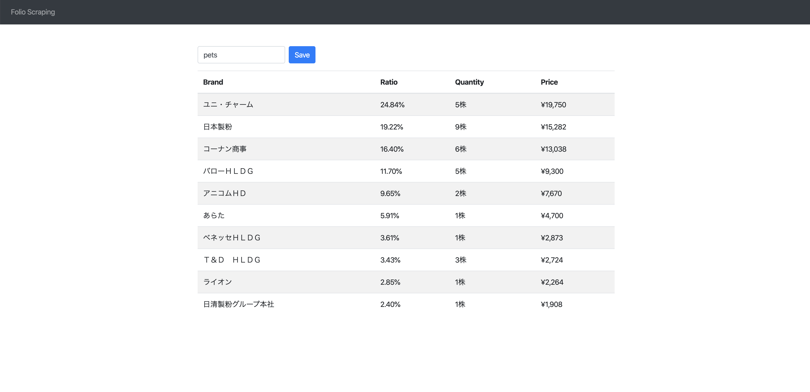

# 環境構築手順

* `git clone --recursive https://github.com/yaizuuuu/folio-scraping`
* `docker run --rm -it -v $(pwd)/folio-scraping-api:/opt/api -w /opt/api node:12.16.1-alpine3.11 npm install`
* `docker run --rm -it -v $(pwd)/folio-scraping-front:/opt/front -w /opt/front node:12.16.1-alpine3.11 npm install`
* `docker-compose -f ./docker/docker-compose.yml build`

# アプリケーションの実行

* `docker-compose -f ./docker/docker-compose.yml up`
* localhost:3000にアクセスする
* テキストフォームに `pets` などのテーマのURIを入力して `Save` をクリック

